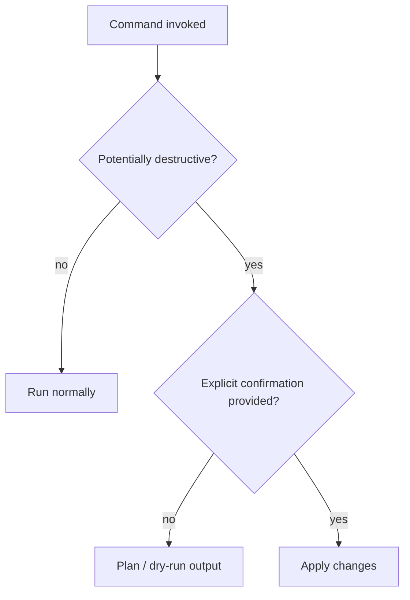
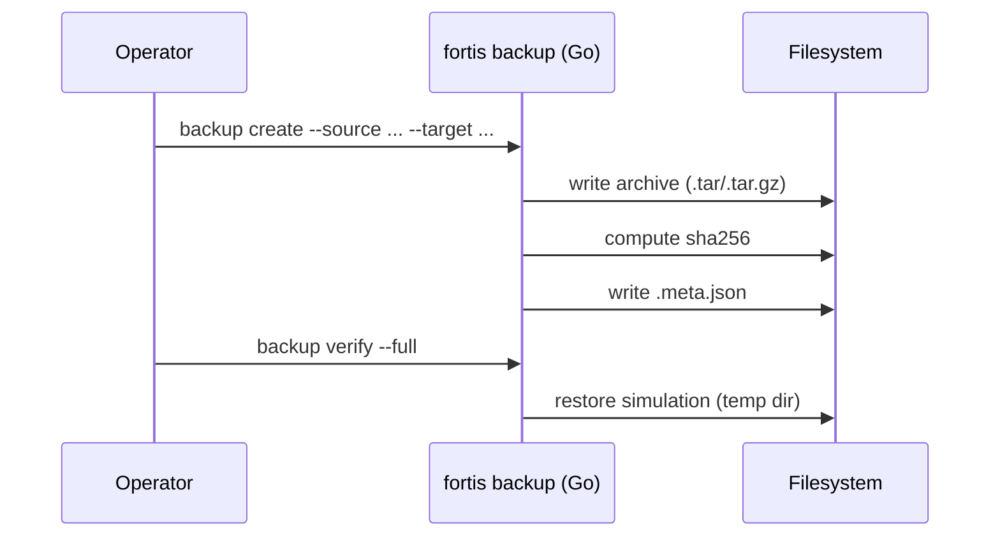
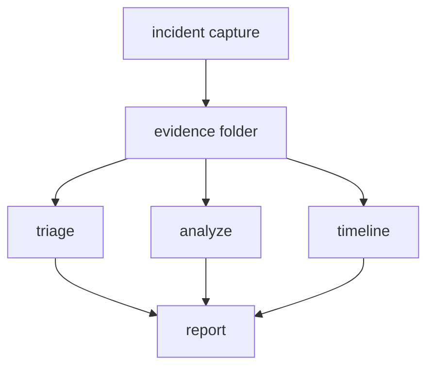
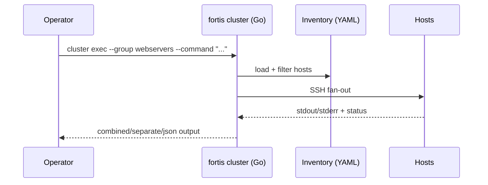

<div align="center">

# FORTIS-ADMIN


<p><b>Server Hardening</b> · <b>Incident Response</b> · <b>Backups</b> · <b>Cluster Ops</b></p>

<p>
  
  
  
  
  
  
  
</p>

<p>
  
</p>

<p>
  <a href="#quickstart">Quickstart</a> ·
  <a href="#features">Features</a> ·
  <a href="#system-design">System Design</a> ·
  <a href="#commands--examples">Commands & Examples</a> ·
  <a href="#community--support">Community</a>
</p>

</div>

---

## 🧭 About

FORTIS-ADMIN is a modular SysAdmin automation CLI for:

- Server hardening automation
- Incident response toolkit
- Backup & recovery
- Multi-server (cluster) management

It combines a Go-based CLI with safe-by-default Bash helpers.

**Creator:** Lily Yang

<table>
  <tr>
    <td><b>🛡️ Hardening</b><br/>CIS-style audits, firewall/kernel tuning, SSH/user policy helpers</td>
    <td><b>🕵️ Incident</b><br/>Capture, triage, analyze, timeline, reports</td>
  </tr>
  <tr>
    <td><b>💾 Backup</b><br/>Create/verify/restore, catalogs, schedulers (safe)</td>
    <td><b>🖧 Cluster</b><br/>Inventory, exec, monitoring, patch planning</td>
  </tr>
</table>

> **Safety model:** Commands that can change system state require explicit confirmation (e.g., `--yes`, `--apply`).

**Design principles**

- **Safe-by-default**: actions that can change system state require explicit confirmation (e.g., `--yes`, `--apply`)
- **Portable**: minimal dependencies, works well over SSH
- **Extensible**: add scripts and/or Go modules without rewriting the CLI

---

## 🗂️ Table of Contents

- [Quickstart](#quickstart)
- [Features](#features)
- [System Design](#system-design)
- [Commands & Examples](#commands--examples)
- [OS Support](#os-support)
- [Git Status (Real Time)](#git-status-real-time)
- [Community & Support](#community--support)
- [License](#license)
- [Plugins](#plugins)

---

## ⚡ Quickstart

### Build

```bash
go mod tidy
go build -o fortis ./cmd/fortis
```

### Run

```bash
./fortis --help
./fortis --version
```

### Configuration

- **Default config path:** `/etc/fortis/config.yaml`
- **Template:** `configs/config.yaml`

---

## ✨ Features

<details open>
<summary><b>🛡️ Server Hardening Automation</b></summary>

- `fortis harden audit` (Go): security audit, scoring, JSON/YAML/HTML output
- `fortis harden apply` (Go): profile application with dry-run + rollback
- `fortis harden firewall` (Go): firewall planning and apply gate with `--yes`
- `fortis harden kernel` (Go): sysctl planning and apply gate with `--yes`
- `fortis harden filesystem` (Go): filesystem permission audits
- `fortis harden package-audit` (Go): package inventory/audit
- `fortis harden ssh` (Bash): safe-by-default SSH hardening helper
- `fortis harden users` (Bash): safe-by-default password/sudo/session policy helper
- `fortis harden compliance` (Go): compliance reports (JSON/HTML; PDF intentionally stubbed)

</details>

<details>
<summary><b>🕵️ Incident Response Toolkit</b></summary>

- `fortis incident capture` (Go): evidence capture + integrity manifest + compression
- `fortis incident triage` (Go): quick/full triage with `--output`
- `fortis incident analyze` (Go): IOC matching and analysis report
- `fortis incident timeline` (Go): timeline generation (csv/json/html)
- `fortis incident report` (Go): markdown report generator
- `fortis incident ioc` (Go): local IOC store manager
- `fortis incident logs analyze` (Go): log analysis with IOC matching

</details>

<details>
<summary><b>💾 Backup & Recovery</b></summary>

- `fortis backup create` (Go): tar/tar.gz backups + `.meta.json` sidecar + SHA256
- `fortis backup list` (Go): lists backups from sidecar metadata
- `fortis backup verify` (Go): checksum validation + optional restore simulation (`--full`)
- `fortis backup restore` (Go): restore archives
- `fortis backup catalog` (Go): list/search archive contents

Advanced (hidden from `--help` to keep the CLI surface minimal):

- `fortis backup snapshot` (Go): snapshot manager planner (backend detection; apply stub)
- `fortis backup restore-wizard` (Go): interactive restore wizard (dry-run by default)

</details>

<details>
<summary><b>🖧 Multi-Server (Cluster) Management</b></summary>

- `fortis cluster init` (Go): creates an inventory template + SSH guidance (safe)
- `fortis cluster inventory` (Go): read inventory YAML and output text/json
- `fortis cluster exec` (Go): parallel SSH command execution (text/json output)
- `fortis cluster monitor` (Go): basic metrics + health score + JSON export
- `fortis cluster patch` (Go): patch plan (dry-run) and gated apply (`--apply --yes`)

</details>

---

## 🧩 System Design

### High-level architecture

```mermaid
flowchart LR
  U[Operator / CI] --> CLI[fortis CLI (Go)]
  CLI -->|Safe core| GO[internal/* (Go engines)]
  CLI -->|OS helpers| SH[scripts/*.sh]
  GO --> FS[(Local filesystem)]
  SH --> FS
  CLI -->|SSH fan-out| R[(Remote nodes)]
```

### Safety model (why `--yes` exists)



### Data flow: backups



### Data flow: incident response



### Data flow: cluster execution



---

## 📘 Command Usage Guide

### Safe-by-default flags

- `--yes`:
  - Used to confirm actions that may change system state.
  - Common in hardening and cluster operations.
- `--apply`:
  - Used when a command supports generating a plan first and applying later.
  - Common in patching/snapshots.

### Output formats

- Prefer `--output json` (or similar flags) for automation.
- Use `--verbose` for interactive debugging.
- Use `--quiet` for CI/log-friendly output.

### Inventory-driven operations

Cluster commands typically take inventory/SSH flags:

- `--inventory-file` (defaults to `/etc/fortis/inventory.yaml`)
- `--ssh-user`, `--ssh-port`, `--ssh-key`

### Scripts vs Go

Some commands call scripts in `./scripts` for OS-level configuration changes.

- Keep scripts audited and version-controlled.
- Run on a test host first.

---

## ⌨️ Commands & Examples

### Hardening: audit + apply (safe gate)

```bash
./fortis harden audit --profile cis --output ./audit.html
./fortis harden firewall --profile webserver
./fortis harden firewall --profile webserver --yes
```

Sample output (illustrative):

```text
Audit complete. Score: 78/100 (Medium). Report: ./audit.html
```

### Incident response: capture + triage

```bash
./fortis incident capture --case incident-001 --type all --integrity --compress
./fortis incident triage --full --output ./evidence/triage.txt
```

Sample output (illustrative):

```json
{
  "case_id": "incident-001",
  "output_dir": "./evidence/incident-001",
  "timestamp": "2024-01-15T14:30:00Z",
  "notes": ["OS=linux", "HOST=web01"]
}
```

### Backup: create + verify

```bash
./fortis backup create --source /etc --target ./backups
./fortis backup verify --backup ./backups/backup-YYYYMMDD-HHMMSS.tar.gz --full
```

Sample output (illustrative):

```json
{
  "backup_path": "./backups/backup-20240115-143000.tar.gz",
  "ok": true,
  "reason": "checksum validated",
  "sha256": "<sha256>"
}
```

### Cluster: inventory + exec

```bash
./fortis cluster init --inventory-file ./configs/inventory.yaml
./fortis cluster inventory --inventory-file ./configs/inventory.yaml --output json
./fortis cluster exec --inventory-file ./configs/inventory.yaml --group webservers --command "uname -a" --output json
```

---

## 🧪 OS Support

- Linux (primary target)
- macOS: build/test support; many hardening/forensic actions are Linux-oriented
- Windows: not currently supported for most workflows

---

## 🧷 Git Status (Real Time)

```bash
git status -sb
git diff
git diff --stat
```

Live refresh (macOS/Linux):

```bash
watch -n 1 git status -sb
```

---

## 🤝 Community & Support

- **Documentation:** https://fortis-admin.readthedocs.io
- **Source:** https://github.com/lily0ng/Fortis-Admin
- **Issues:** https://github.com/lily0ng/Fortis-Admin/issues
- **Discussions:** GitHub Discussions (recommended)
- **Issue reports:** include OS/version + `fortis --version` + command output

---

## 🧾 License

Open source.

- If your repository includes a `LICENSE` file, that is the authoritative license.
- If not, add one (MIT/Apache-2.0/GPL-3.0 are common choices).

---

## 🧩 Plugins

Drop executables into `./plugins` and run:

```bash
./fortis plugin list
./fortis plugin run <plugin> [args...]
```
