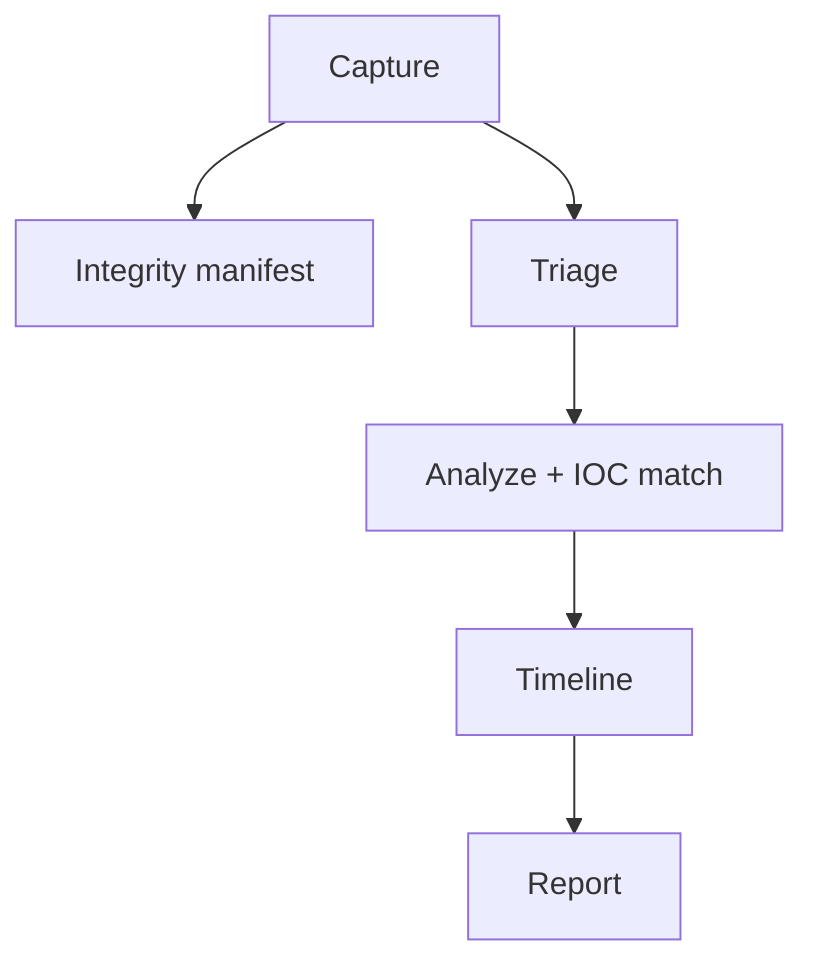
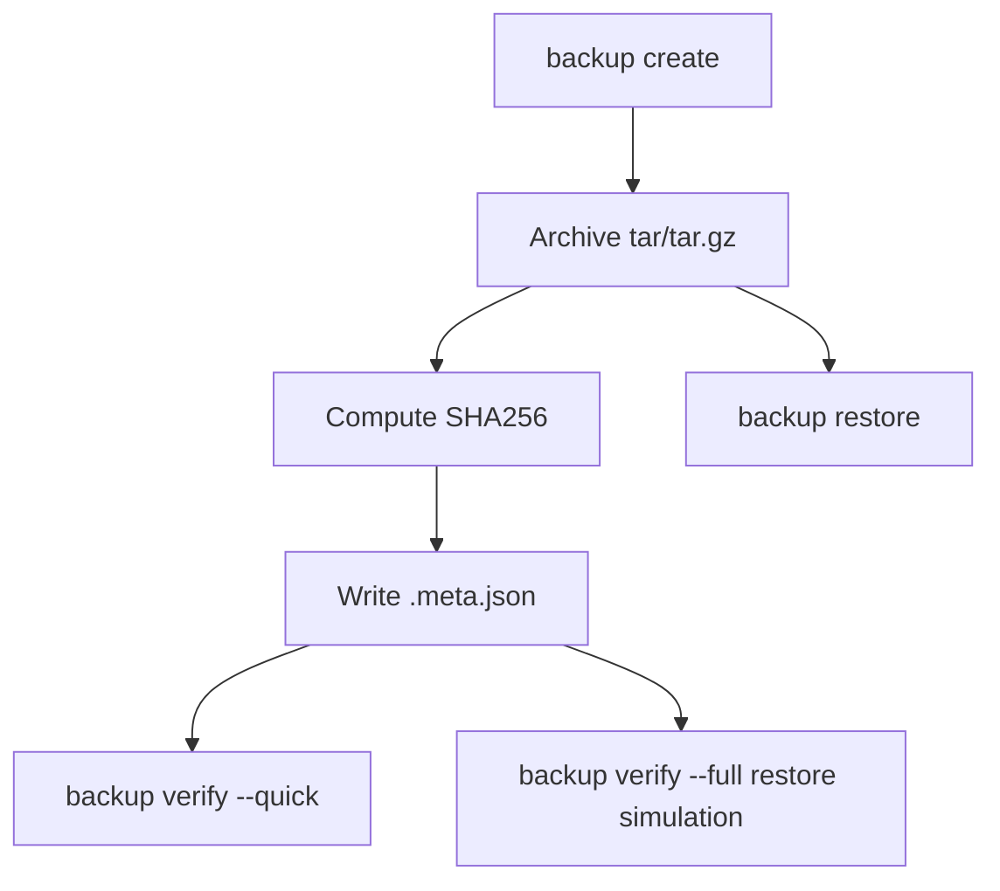

# FORTIS-ADMIN

FORTIS-ADMIN is a modular SysAdmin automation CLI for:

- Server hardening automation
- Incident response toolkit
- Backup & recovery system
- Multi-server (cluster) management

It combines a Go-based CLI (Cobra) with safe-by-default Bash helpers.

## About

FORTIS-ADMIN is designed to help operators standardize security and operations workflows across Linux servers.

Core design goals:

- Safe-by-default: potentially intrusive actions require explicit confirmation (e.g., `--yes`, `--apply`)
- Portable: minimal dependencies, works well over SSH
- Extensible: add scripts and/or Go modules without rewriting the CLI

## Creator

- **Creator:** Fortis-Admin Community
- If you fork this repository, please update this section with your name/org.

## Community Join

- **Documentation:** https://fortis-admin.readthedocs.io
- **Source / Forks:** GitHub repository for this project
- **Discussions:** GitHub Discussions (recommended)

## Issue Reports

If you find a bug or want to request a feature:

- Include your OS + version
- Include `fortis --version`
- Include the exact command you ran and its output
- If relevant, include the config file you used (redact secrets)

## Supports / Help

- Check `./fortis --help` and `./fortis <group> --help`
- Use `--verbose` to get more diagnostic output
- Use `--quiet` for automation-friendly output

## Features

### Server Hardening Automation

- `fortis harden audit` (Go): security audit, scoring, JSON/YAML/HTML output
- `fortis harden apply` (Go): profile application with dry-run + rollback
- `fortis harden firewall` (Go): firewall planning and apply gate with `--yes`
- `fortis harden kernel` (Go): sysctl planning and apply gate with `--yes`
- `fortis harden filesystem` (Go): filesystem permission audits
- `fortis harden package-audit` (Go): package inventory/audit
- `fortis harden ssh` (Bash): safe-by-default SSH hardening helper
- `fortis harden users` (Bash): safe-by-default password/sudo/session policy helper
- `fortis harden compliance` (Go): compliance reports (JSON/HTML; PDF is intentionally stubbed)

### Incident Response Toolkit

- `fortis incident capture` (Go): evidence capture + optional integrity manifest + compression
- `fortis incident triage` (Go): quick/full triage with `--output`
- `fortis incident analyze` (Go): IOC matching and analysis report
- `fortis incident timeline` (Go): timeline generation (csv/json/html)
- `fortis incident report` (Go): markdown report generator
- `fortis incident ioc` (Go): local IOC store manager
- `fortis incident logs analyze` (Go): log analysis with IOC matching

### Backup & Recovery

- `fortis backup create` (Go): tar/tar.gz backups + `.meta.json` sidecar + SHA256
- `fortis backup list` (Go): lists backups from sidecar metadata
- `fortis backup verify` (Go): checksum validation + optional restore simulation (`--full`)
- `fortis backup restore` (Go): restore archives
- `fortis backup catalog` (Go): list/search archive contents
- `fortis backup snapshot` (Go): snapshot manager planner (backend detection; apply stub)
- `fortis backup restore-wizard` (Go): interactive restore wizard (dry-run by default)

### Multi-Server (Cluster) Management

- `fortis cluster init` (Go): creates an inventory template + SSH guidance (safe)
- `fortis cluster inventory` (Go): read inventory YAML and output text/json
- `fortis cluster exec` (Go): parallel SSH command execution (text/json output)
- `fortis cluster monitor` (Go): basic metrics + health score + JSON export
- `fortis cluster patch` (Go): patch plan (dry-run) and gated apply (`--apply --yes`)

## How FORTIS-ADMIN Works

FORTIS-ADMIN is a Go CLI that:

- Implements safe core logic in Go for auditing, evidence capture, and backup primitives
- Calls Bash scripts for actions where OS-level changes can be intrusive or require distro-specific handling

Global flags are propagated to scripts using environment variables:

- `FORTIS_CONFIG` (config path)
- `FORTIS_DEBUG`, `FORTIS_VERBOSE`, `FORTIS_QUIET`
- `FORTIS_COLOR` / `FORTIS_NO_COLOR`

## How To Use

### Build

```bash
go mod tidy
go build -o fortis ./cmd/fortis
```

### Run

```bash
./fortis --help
./fortis --version
```

### Configuration

Default config path:

- `/etc/fortis/config.yaml`

A starter template is provided in:

- `configs/config.yaml`

## Example Usage

### Hardening

```bash
./fortis harden audit --profile cis --output ./audit.html
./fortis harden firewall --profile webserver
./fortis harden firewall --profile webserver --yes
./fortis harden ssh --disable-root --key-only
./fortis harden ssh --disable-root --key-only --yes
./fortis harden compliance --standard pci-dss --gap-analysis --export ./compliance.json
```

### Incident Response

```bash
./fortis incident capture --case incident-001 --type all --integrity --compress
./fortis incident triage --full --output ./evidence/triage.txt
./fortis incident analyze --input ./evidence/incident-001 --ioc ./iocs.txt
./fortis incident report --format markdown --executive --technical --evidence --output ./incident-report.md
```

### Backup & Recovery

```bash
./fortis backup create --source /etc --target ./backups
./fortis backup list --target ./backups
./fortis backup verify --backup ./backups/backup-YYYYMMDD-HHMMSS.tar.gz --full
./fortis backup restore --backup ./backups/backup-YYYYMMDD-HHMMSS.tar.gz --target ./restore --dry-run
./fortis backup restore-wizard --backup ./backups/backup-YYYYMMDD-HHMMSS.tar.gz
./fortis backup snapshot --volume tank/root --keep 7
```

### Cluster

```bash
./fortis cluster init --inventory-file ./configs/inventory.yaml
./fortis cluster inventory --inventory-file ./configs/inventory.yaml --output json
./fortis cluster exec --inventory-file ./configs/inventory.yaml --group webservers --command "uname -a" --output json
./fortis cluster monitor --inventory-file ./configs/inventory.yaml --group production --output json --export ./cluster-health.json
./fortis cluster patch --inventory-file ./configs/inventory.yaml --packages openssl --strategy rolling --batch-size 2
```

## OS Supports

- Linux (primary target)
- macOS: build/test support; many hardening/forensic actions are Linux-oriented
- Windows: not currently supported for most workflows

## Workflow Diagrams (3)

### 1) Hardening workflow

```mermaid
flowchart TD
  A[Operator runs fortis harden audit] --> B[Go checks + scoring]
  B --> C[Report: JSON/YAML/HTML]
  C --> D{Fix requested?}
  D -- no --> E[Stop]
  D -- yes + --yes --> F[Apply low-risk remediations]
```

### 2) Incident response workflow



### 3) Backup workflow



## Git Status (Real Time)

Examples for monitoring changes while developing:

```bash
git status -sb
git diff
git diff --stat
```

If you want a live refresh (macOS/Linux):

```bash
watch -n 1 git status -sb
```

## License

Open source.

- If your repository includes a `LICENSE` file, that is the authoritative license.
- If not, add one (MIT/Apache-2.0/GPL-3.0 are common choices).

## Plugins

Drop executables into `./plugins` and run:

```bash
./fortis plugin list
./fortis plugin run <plugin> [args...]
```
